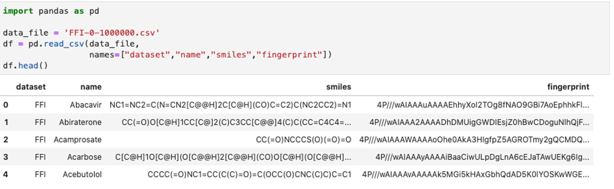
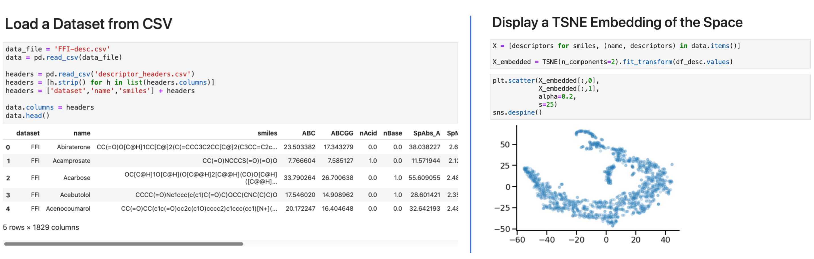
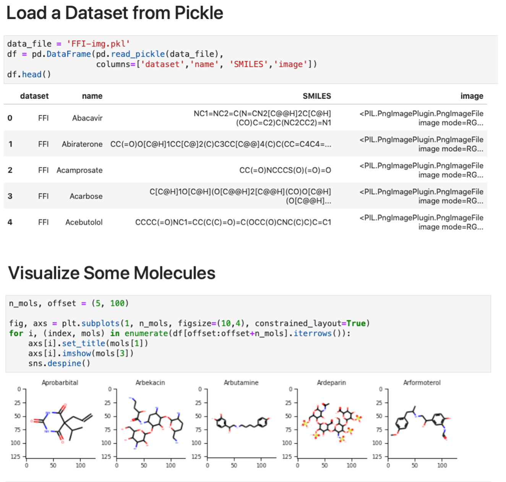
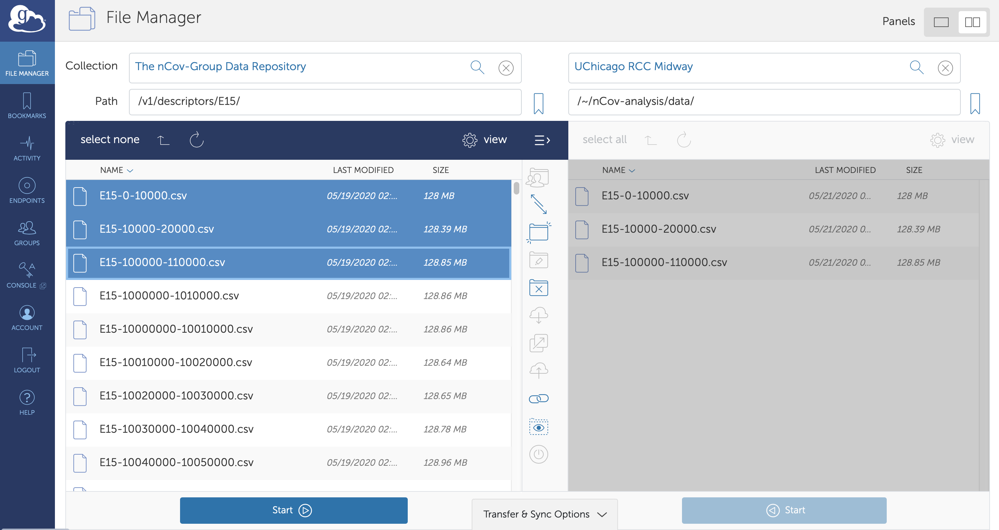

# The nCov-Group Data Repository
{: .fs-9 .no_toc }

## Targeting SARS-CoV-2 with AI- and HPC-enabled Lead Generation
{: .no_toc }

This repository provides access to data, models, and code produced by the **nCoV Group** in support of research aimed at generating leads for potential SARS-CoV-2 drugs. The data include representations and computed descriptors for around **4.2 billion** small molecules: some 60 TB of data in all, although many useful subsets are much smaller.

These data will be updated regularly as the collaboration produces new results. Shared data are located on the nCov-Group Data Repository endpoint [at this location](https://app.globus.org/file-manager?origin_id=1c8debe9-00f9-4bc7-81e3-3f1fdcbe4b8e&origin_path=/release/v1.0/), from where they can be accessed via [Globus](https://www.globus.org). To access the data, users should: 1) log in with existing credentials ([link](https://www.globus.org)) and 2) access the [Globus endpoint](https://app.globus.org/file-manager?origin_id=1c8debe9-00f9-4bc7-81e3-3f1fdcbe4b8e&origin_path=/release/v1.0/).

## Papers

[Targeting SARS-CoV-2 with AI- and HPC-enabled Lead Generation: A First Data Release](https://arxiv.org/abs/2006.02431){: .btn .btn-outline }

[IMPECCABLE: integrated modeling pipelinE for COVID cure by assessing better LEads](https://dl.acm.org/doi/abs/10.1145/3472456.3473524){: .btn .btn-outline }

[High-Throughput Virtual Screening and Validation of a SARS-CoV-2 Main Protease Noncovalent Inhibitor](https://pubs.acs.org/doi/abs/10.1021/acs.jcim.1c00851){: .btn .btn-outline }

[Protein-Ligand Docking Surrogate Models: A SARS-CoV-2 Benchmark for Deep Learning Accelerated Virtual Screening](https://arxiv.org/pdf/2106.07036){: .btn .btn-outline }


## Table of contents
{: .no_toc }

* TOC
{:toc}

## Data Processing Pipeline
The data processing pipeline is used to compute different types of features and representations of billions of small molecules.  The pipeline is first used to convert the SMILES representation for each molecule to a canonical SMILES to allow for de-duplication and consistency across data sources.  Next, for each molecule, three different types of features are computed:  1) molecular fingerprints that encode the structure of molecules;  2) 2D and 3D molecular descriptors;  and 3)  2D  images  of  the  molecular  structure.   These  features  are  being  used  as  input  to  various machine learning and deep learning models that will be used to predict important characteristics of candidate molecules including docking scores, toxicity, and more.


**Figure 1:  The computational pipeline that is used to enrich the data collected from includeddatasets.  After  collection,  each  molecule  in  each  dataset  has  canonical  SMILES,  2D  and 3D  molecular  features,  fingerprints,  and  images  computed.   These  enrichments  simplifymolecule disambiguation, ML-guided compound screening, similarity searching, and neuralnetwork training respectively.**

---

## Dataset Catalog
We have obtained molecule definitions from the following source datasets.
For each, we provide a link to the original source, the number of molecules included from the dataset,
and the percentage of those molecules that are not found in any other listed dataset.

Key | Description and link | # Molecules | % Uniq
:-: | --- | --: | --:
BDB | [The Binding Database](https://www.bindingdb.org/bind/index.jsp) | 1,813,538 | 20.4
CAS | [CAS COVID-19 Antiviral Candidate Compounds](https://www.cas.org/covid-19-antiviral-compounds-dataset) | 49,437 | 55.5
CHM | CheMBL db of bioactive mols with drug-like properties | 1,940,732 |
DBK | [Drugbank](https://www.drugbank.ca) | 10,095 | 76.1
DCL | [DrugCentral Online Drug Compendium](http://drugcentral.org) | 3,981 | 2.4
DUD | [DUDE database of useful decoys](http://dude.docking.org) | 99,782 | 99.7
E15 | 15.5M-molecule subset of ENA | 15,547,091 | 99.7
EDB | DrugBank plus [Enamine Hit Locator Library 2018](https://enamine.net/hit-finding/diversity-libraries/hit-locator-library-300) | 310,782 | 61.2
EMO | [eMolecules](https://www.emolecules.com/info/products-data-downloads.html) | 25,946,988 | 93.9
ENA | [Enamine REAL Database](https://enamine.net/library-synthesis/real-compounds/real-database) | 1,211,723,723 | 85.9
FFI | [CureFFI FDA-approved drugs and CNS drugs](https://www.cureffi.org/2013/10/04/list-of-fda-approved-drugs-and-cns-drugs-with-smiles/) | 1,497 | 12.2
G13 | [GDB-13 small organic molecules up to 13 atoms](http://gdb.unibe.ch/downloads/) | 977,468,301 | 99.5
G17 | [GDB-17-Set up to 17 atom extension of GDB-13](http://gdb.unibe.ch/downloads/) | 50,000,000 | 100.0
HOP | [Harvard Organic Photovoltaic Dataset](https://www.nature.com/articles/sdata201686) | 350 | 83.7
LIT | [COVID-relevant small mols extracted from literature](https://doi.org/10.26311/LIT) | 803 |
MOS | [Molecular Sets (MOSES)](https://github.com/molecularsets/moses) | 1,936,962 | 81.3
MCU | [MCULE compound database](https://mcule.com) | 45,472,755 |
PCH | [PubChem](https://www.ncbi.nlm.nih.gov/guide/data-software/) | 97,545,266 | 48.5
QM9 | [QM9 subset of GDB-17](http://quantum-machine.org/datasets/) | 133,885 | 84.0
REP | [Repurposing-related drug/tool compounds](https://clue.io/data/REP#REP) | 13,553 | 0.0
SAV | [Synthetically Accessible Virtual Inventory (SAVI)](https://cactus.nci.nih.gov/download/savi_download/) | 283,194,309 | 99.8
SUR | [SureChEMBL dataset of molecules from patents](https://surechembl.org/) | 17,915,384 | 9.8
ZIN | [ZINC15](http://zinc15.docking.org) | 1,475,804,828 | 85.1
**Total** | | **4,206,934,042** |

Notes:
{: .label .label-blue }
* The key for each dataset may be used in filenames in place of the full name in downloads elsewhere. 
* The numbers above may be less than what can be found at the source, due to conversion failures and/or version differences.
* These numbers do not account for de-duplication, within or between datasets.

## Dataset Downloads
Follow the links below to access canonical SMILES, molecular fingerprints, descriptors, and images (png format) for each dataset.  The links in the final row provide access to all SMILES, fingerprints, descriptors, and images, respectively.

Key | Canonical SMILES | Fingerprints | Descriptors | Images
:-: | :-: | :-: | :-:  | :-:
BDB | [1 file; 132 MB](https://app.globus.org/file-manager?origin_id=1c8debe9-00f9-4bc7-81e3-3f1fdcbe4b8e&origin_path=/release/v1.0/canonical_smiles/BDB/) | [2 files; 302 MB](https://app.globus.org/file-manager?origin_id=1c8debe9-00f9-4bc7-81e3-3f1fdcbe4b8e&origin_path=/release/v1.0/fingerprints/BDB/) | [TBD link](https://app.globus.org/file-manager?origin_id=1c8debe9-00f9-4bc7-81e3-3f1fdcbe4b8e&origin_path=/release/v1.0/descriptors/BDB/) | [TBD link](https://app.globus.org/file-manager?origin_id=1c8debe9-00f9-4bc7-81e3-3f1fdcbe4b8e&origin_path=/release/v1.0/images/BDB/) | 
CAS | [1 file; 4 MB](https://app.globus.org/file-manager?origin_id=1c8debe9-00f9-4bc7-81e3-3f1fdcbe4b8e&origin_path=/release/v1.0/canonical_smiles/CAS/) | [1 file; 9 MB](https://app.globus.org/file-manager?origin_id=1c8debe9-00f9-4bc7-81e3-3f1fdcbe4b8e&origin_path=/release/v1.0/fingerprints/CAS/) | [5 files; 350 MB](https://app.globus.org/file-manager?origin_id=1c8debe9-00f9-4bc7-81e3-3f1fdcbe4b8e&origin_path=/release/v1.0/descriptors/CAS/) | [5 files; 2 GB](https://app.globus.org/file-manager?origin_id=1c8debe9-00f9-4bc7-81e3-3f1fdcbe4b8e&origin_path=/release/v1.0/images/CAS/) | 
DBK | [1 file; 650 KB](https://app.globus.org/file-manager?origin_id=1c8debe9-00f9-4bc7-81e3-3f1fdcbe4b8e&origin_path=/release/v1.0/canonical_smiles/DBK/) | [2 files; 2 MB](https://app.globus.org/file-manager?origin_id=1c8debe9-00f9-4bc7-81e3-3f1fdcbe4b8e&origin_path=/release/v1.0/fingerprints/DBK/) | [1 file; 71 MB](https://app.globus.org/file-manager?origin_id=1c8debe9-00f9-4bc7-81e3-3f1fdcbe4b8e&origin_path=/release/v1.0/descriptors/DBK/) | [1 file; 476 MB](https://app.globus.org/file-manager?origin_id=1c8debe9-00f9-4bc7-81e3-3f1fdcbe4b8e&origin_path=/release/v1.0/images/DBK/) | 
DCL | [1 file; 260 KB](https://app.globus.org/file-manager?origin_id=1c8debe9-00f9-4bc7-81e3-3f1fdcbe4b8e&origin_path=/release/v1.0/canonical_smiles/DCL/) | [1 file; 576 KB](https://app.globus.org/file-manager?origin_id=1c8debe9-00f9-4bc7-81e3-3f1fdcbe4b8e&origin_path=/release/v1.0/fingerprints/DCL/) | [1 file; 29 MB](https://app.globus.org/file-manager?origin_id=1c8debe9-00f9-4bc7-81e3-3f1fdcbe4b8e&origin_path=/release/v1.0/descriptors/DCL/) | [1 file; 196 MB](https://app.globus.org/file-manager?origin_id=1c8debe9-00f9-4bc7-81e3-3f1fdcbe4b8e&origin_path=/release/v1.0/images/DCL/) | 
DUD | [1 file; 7 MB](https://app.globus.org/file-manager?origin_id=1c8debe9-00f9-4bc7-81e3-3f1fdcbe4b8e&origin_path=/release/v1.0/canonical_smiles/DUD/) | [2 files; 32 MB](https://app.globus.org/file-manager?origin_id=1c8debe9-00f9-4bc7-81e3-3f1fdcbe4b8e&origin_path=/release/v1.0/fingerprints/DUD/) | [10 files; 745 MB](https://app.globus.org/file-manager?origin_id=1c8debe9-00f9-4bc7-81e3-3f1fdcbe4b8e&origin_path=/release/v1.0/descriptors/DUD/) | [10 files; 4 GB](https://app.globus.org/file-manager?origin_id=1c8debe9-00f9-4bc7-81e3-3f1fdcbe4b8e&origin_path=/release/v1.0/images/DUD/) | 
E15 | [1 file; 1 GB](https://app.globus.org/file-manager?origin_id=1c8debe9-00f9-4bc7-81e3-3f1fdcbe4b8e&origin_path=/release/v1.0/canonical_smiles/E15/) | [16 files; 2 GB](https://app.globus.org/file-manager?origin_id=1c8debe9-00f9-4bc7-81e3-3f1fdcbe4b8e&origin_path=/release/v1.0/fingerprints/E15/) | [1,555 files; 116 GB](https://app.globus.org/file-manager?origin_id=1c8debe9-00f9-4bc7-81e3-3f1fdcbe4b8e&origin_path=/release/v1.0/descriptors/E15/) | [1,555 files; 765 GB](https://app.globus.org/file-manager?origin_id=1c8debe9-00f9-4bc7-81e3-3f1fdcbe4b8e&origin_path=/release/v1.0/images/E15/) | 
EDB | [1 file; 18 MB](https://app.globus.org/file-manager?origin_id=1c8debe9-00f9-4bc7-81e3-3f1fdcbe4b8e&origin_path=/release/v1.0/canonical_smiles/EDB/) | [1 file; 44 MB](https://app.globus.org/file-manager?origin_id=1c8debe9-00f9-4bc7-81e3-3f1fdcbe4b8e&origin_path=/release/v1.0/fingerprints/EDB/) | [28 files; 2 GB](https://app.globus.org/file-manager?origin_id=1c8debe9-00f9-4bc7-81e3-3f1fdcbe4b8e&origin_path=/release/v1.0/descriptors/EDB/) | [32 files; 15 GB](https://app.globus.org/file-manager?origin_id=1c8debe9-00f9-4bc7-81e3-3f1fdcbe4b8e&origin_path=/release/v1.0/images/EDB/) | 
EMO | [1 file; 1 GB](https://app.globus.org/file-manager?origin_id=1c8debe9-00f9-4bc7-81e3-3f1fdcbe4b8e&origin_path=/release/v1.0/canonical_smiles/EMO/) | [26 files; 3 GB](https://app.globus.org/file-manager?origin_id=1c8debe9-00f9-4bc7-81e3-3f1fdcbe4b8e&origin_path=/release/v1.0/fingerprints/EMO/) | [2,232 files; 165 GB](https://app.globus.org/file-manager?origin_id=1c8debe9-00f9-4bc7-81e3-3f1fdcbe4b8e&origin_path=/release/v1.0/descriptors/EMO/) | [2,595 files; 1 TB](https://app.globus.org/file-manager?origin_id=1c8debe9-00f9-4bc7-81e3-3f1fdcbe4b8e&origin_path=/release/v1.0/images/EMO/) | 
ENA | [1 file; 85 GB](https://app.globus.org/file-manager?origin_id=1c8debe9-00f9-4bc7-81e3-3f1fdcbe4b8e&origin_path=/release/v1.0/canonical_smiles/ENA/) | [1,212 files; 191 GB](https://app.globus.org/file-manager?origin_id=1c8debe9-00f9-4bc7-81e3-3f1fdcbe4b8e&origin_path=/release/v1.0/fingerprints/ENA/) | [120,692 files; 8 TB](https://app.globus.org/file-manager?origin_id=1c8debe9-00f9-4bc7-81e3-3f1fdcbe4b8e&origin_path=/release/v1.0/descriptors/ENA/) | [TBD link](https://app.globus.org/file-manager?origin_id=1c8debe9-00f9-4bc7-81e3-3f1fdcbe4b8e&origin_path=/release/v1.0/images/ENA/) | 
FFI | [1 file; 117 KB](https://app.globus.org/file-manager?origin_id=1c8debe9-00f9-4bc7-81e3-3f1fdcbe4b8e&origin_path=/release/v1.0/canonical_smiles/FFI/) | [1 file; 239 KB](https://app.globus.org/file-manager?origin_id=1c8debe9-00f9-4bc7-81e3-3f1fdcbe4b8e&origin_path=/release/v1.0/fingerprints/FFI/) | [1 file; 11 MB](https://app.globus.org/file-manager?origin_id=1c8debe9-00f9-4bc7-81e3-3f1fdcbe4b8e&origin_path=/release/v1.0/descriptors/FFI/) | [1 file; 73 MB](https://app.globus.org/file-manager?origin_id=1c8debe9-00f9-4bc7-81e3-3f1fdcbe4b8e&origin_path=/release/v1.0/images/FFI/) | 
G13 | [1 file; 36 GB](https://app.globus.org/file-manager?origin_id=1c8debe9-00f9-4bc7-81e3-3f1fdcbe4b8e&origin_path=/release/v1.0/canonical_smiles/G13/) | [978 files; 101 GB](https://app.globus.org/file-manager?origin_id=1c8debe9-00f9-4bc7-81e3-3f1fdcbe4b8e&origin_path=/release/v1.0/fingerprints/G13/) | [97,739 files; 7 TB](https://app.globus.org/file-manager?origin_id=1c8debe9-00f9-4bc7-81e3-3f1fdcbe4b8e&origin_path=/release/v1.0/descriptors/G13/) | [TBD link](https://app.globus.org/file-manager?origin_id=1c8debe9-00f9-4bc7-81e3-3f1fdcbe4b8e&origin_path=/release/v1.0/images/G13/) | 
G17 | [1 file; 2 GB](https://app.globus.org/file-manager?origin_id=1c8debe9-00f9-4bc7-81e3-3f1fdcbe4b8e&origin_path=/release/v1.0/canonical_smiles/G17/) | [51 files; 5 GB](https://app.globus.org/file-manager?origin_id=1c8debe9-00f9-4bc7-81e3-3f1fdcbe4b8e&origin_path=/release/v1.0/fingerprints/G17/) | [5,000 files; 371 GB](https://app.globus.org/file-manager?origin_id=1c8debe9-00f9-4bc7-81e3-3f1fdcbe4b8e&origin_path=/release/v1.0/descriptors/G17/) | [5,000 files; 2 TB](https://app.globus.org/file-manager?origin_id=1c8debe9-00f9-4bc7-81e3-3f1fdcbe4b8e&origin_path=/release/v1.0/images/G17/) | 
HOP | [1 file; 37 KB](https://app.globus.org/file-manager?origin_id=1c8debe9-00f9-4bc7-81e3-3f1fdcbe4b8e&origin_path=/release/v1.0/canonical_smiles/HOP/) | [1 file; 68 KB](https://app.globus.org/file-manager?origin_id=1c8debe9-00f9-4bc7-81e3-3f1fdcbe4b8e&origin_path=/release/v1.0/fingerprints/HOP/) | [1 file; 2 MB](https://app.globus.org/file-manager?origin_id=1c8debe9-00f9-4bc7-81e3-3f1fdcbe4b8e&origin_path=/release/v1.0/descriptors/HOP/) | [1 file; 17 MB](https://app.globus.org/file-manager?origin_id=1c8debe9-00f9-4bc7-81e3-3f1fdcbe4b8e&origin_path=/release/v1.0/images/HOP/) | 
LIT | [TBD link](https://app.globus.org/file-manager?origin_id=1c8debe9-00f9-4bc7-81e3-3f1fdcbe4b8e&origin_path=/release/v1.0/canonical_smiles/LIT/) | [TBD link](https://app.globus.org/file-manager?origin_id=1c8debe9-00f9-4bc7-81e3-3f1fdcbe4b8e&origin_path=/release/v1.0/fingerprints/LIT/) | [TBD link](https://app.globus.org/file-manager?origin_id=1c8debe9-00f9-4bc7-81e3-3f1fdcbe4b8e&origin_path=/release/v1.0/descriptors/LIT/) | [TBD link](https://app.globus.org/file-manager?origin_id=1c8debe9-00f9-4bc7-81e3-3f1fdcbe4b8e&origin_path=/release/v1.0/images/LIT/) | 
MCU | [TBD link](https://app.globus.org/file-manager?origin_id=1c8debe9-00f9-4bc7-81e3-3f1fdcbe4b8e&origin_path=/release/v1.0/canonical_smiles/MCU/) | [TBD link](https://app.globus.org/file-manager?origin_id=1c8debe9-00f9-4bc7-81e3-3f1fdcbe4b8e&origin_path=/release/v1.0/fingerprints/MCU/) | [TBD link](https://app.globus.org/file-manager?origin_id=1c8debe9-00f9-4bc7-81e3-3f1fdcbe4b8e&origin_path=/release/v1.0/descriptors/MCU/) | [TBD link](https://app.globus.org/file-manager?origin_id=1c8debe9-00f9-4bc7-81e3-3f1fdcbe4b8e&origin_path=/release/v1.0/images/MCU/) | 
MOS | [1 file; 93 MB](https://app.globus.org/file-manager?origin_id=1c8debe9-00f9-4bc7-81e3-3f1fdcbe4b8e&origin_path=/release/v1.0/canonical_smiles/MOS/) | [2 files; 250 MB](https://app.globus.org/file-manager?origin_id=1c8debe9-00f9-4bc7-81e3-3f1fdcbe4b8e&origin_path=/release/v1.0/fingerprints/MOS/) | [194 files; 14 GB](https://app.globus.org/file-manager?origin_id=1c8debe9-00f9-4bc7-81e3-3f1fdcbe4b8e&origin_path=/release/v1.0/descriptors/MOS/) | [123 files; 60 GB](https://app.globus.org/file-manager?origin_id=1c8debe9-00f9-4bc7-81e3-3f1fdcbe4b8e&origin_path=/release/v1.0/images/MOS/) | 
PCH | [1 file; 6 GB](https://app.globus.org/file-manager?origin_id=1c8debe9-00f9-4bc7-81e3-3f1fdcbe4b8e&origin_path=/release/v1.0/canonical_smiles/PCH/) | [98 files; 14 GB](https://app.globus.org/file-manager?origin_id=1c8debe9-00f9-4bc7-81e3-3f1fdcbe4b8e&origin_path=/release/v1.0/fingerprints/PCH/) | [9,755 files; 725 GB](https://app.globus.org/file-manager?origin_id=1c8debe9-00f9-4bc7-81e3-3f1fdcbe4b8e&origin_path=/release/v1.0/descriptors/PCH/) | [9,754 files; 4 TB](https://app.globus.org/file-manager?origin_id=1c8debe9-00f9-4bc7-81e3-3f1fdcbe4b8e&origin_path=/release/v1.0/images/PCH/) | 
QM9 | [1 file; 3 MB](https://app.globus.org/file-manager?origin_id=1c8debe9-00f9-4bc7-81e3-3f1fdcbe4b8e&origin_path=/release/v1.0/canonical_smiles/QM9/) | [1 file; 10 MB](https://app.globus.org/file-manager?origin_id=1c8debe9-00f9-4bc7-81e3-3f1fdcbe4b8e&origin_path=/release/v1.0/fingerprints/QM9/) | [14 files; 993 MB](https://app.globus.org/file-manager?origin_id=1c8debe9-00f9-4bc7-81e3-3f1fdcbe4b8e&origin_path=/release/v1.0/descriptors/QM9/) | [14 files; 6 GB](https://app.globus.org/file-manager?origin_id=1c8debe9-00f9-4bc7-81e3-3f1fdcbe4b8e&origin_path=/release/v1.0/images/QM9/) | 
REP | [1 file; 623 KB](https://app.globus.org/file-manager?origin_id=1c8debe9-00f9-4bc7-81e3-3f1fdcbe4b8e&origin_path=/release/v1.0/canonical_smiles/REP/) | [1 file; 1 MB](https://app.globus.org/file-manager?origin_id=1c8debe9-00f9-4bc7-81e3-3f1fdcbe4b8e&origin_path=/release/v1.0/fingerprints/REP/) | [1 file; 46 MB](https://app.globus.org/file-manager?origin_id=1c8debe9-00f9-4bc7-81e3-3f1fdcbe4b8e&origin_path=/release/v1.0/descriptors/REP/) | [1 file; 307 MB](https://app.globus.org/file-manager?origin_id=1c8debe9-00f9-4bc7-81e3-3f1fdcbe4b8e&origin_path=/release/v1.0/images/REP/) | 
SAV | [1 file; 28 GB](https://app.globus.org/file-manager?origin_id=1c8debe9-00f9-4bc7-81e3-3f1fdcbe4b8e&origin_path=/release/v1.0/canonical_smiles/SAV/) | [266 files; 55 GB](https://app.globus.org/file-manager?origin_id=1c8debe9-00f9-4bc7-81e3-3f1fdcbe4b8e&origin_path=/release/v1.0/fingerprints/SAV/) | [28,323 files; 2 TB](https://app.globus.org/file-manager?origin_id=1c8debe9-00f9-4bc7-81e3-3f1fdcbe4b8e&origin_path=/release/v1.0/descriptors/SAV/) | [26,282 files; 12 TB](https://app.globus.org/file-manager?origin_id=1c8debe9-00f9-4bc7-81e3-3f1fdcbe4b8e&origin_path=/release/v1.0/images/SAV/) | 
SUR | [1 file; 1 GB](https://app.globus.org/file-manager?origin_id=1c8debe9-00f9-4bc7-81e3-3f1fdcbe4b8e&origin_path=/release/v1.0/canonical_smiles/SUR/) | [18 files; 2 GB](https://app.globus.org/file-manager?origin_id=1c8debe9-00f9-4bc7-81e3-3f1fdcbe4b8e&origin_path=/release/v1.0/fingerprints/SUR/) | [1,792 files; 132 GB](https://app.globus.org/file-manager?origin_id=1c8debe9-00f9-4bc7-81e3-3f1fdcbe4b8e&origin_path=/release/v1.0/descriptors/SUR/) | [TBD link](https://app.globus.org/file-manager?origin_id=1c8debe9-00f9-4bc7-81e3-3f1fdcbe4b8e&origin_path=/release/v1.0/images/SUR/)  | 
ZIN | [1 file; 85 GB](https://app.globus.org/file-manager?origin_id=1c8debe9-00f9-4bc7-81e3-3f1fdcbe4b8e&origin_path=/release/v1.0/canonical_smiles/ZIN/) | [1,226 files; 193 GB](https://app.globus.org/file-manager?origin_id=1c8debe9-00f9-4bc7-81e3-3f1fdcbe4b8e&origin_path=/release/v1.0/fingerprints/ZIN/) | [147,132 files; 10 TB](https://app.globus.org/file-manager?origin_id=1c8debe9-00f9-4bc7-81e3-3f1fdcbe4b8e&origin_path=/release/v1.0/descriptors/ZIN/) | [TBD link](https://app.globus.org/file-manager?origin_id=1c8debe9-00f9-4bc7-81e3-3f1fdcbe4b8e&origin_path=/release/v1.0/images/ZIN/)  | 
**Total** | [**21 files; 248 GB**](https://app.globus.org/file-manager?origin_id=1c8debe9-00f9-4bc7-81e3-3f1fdcbe4b8e&origin_path=/release/v1.0/canonical_smiles) | [**3,907 files; 571 GB**](https://app.globus.org/file-manager?origin_id=1c8debe9-00f9-4bc7-81e3-3f1fdcbe4b8e&origin_path=/release/v1.0/fingerprints) | [**414 K files; 30 TB**](https://app.globus.org/file-manager?origin_id=1c8debe9-00f9-4bc7-81e3-3f1fdcbe4b8e&origin_path=/release/v1.0/descriptors) | [**412 K files; 49 TB**](https://app.globus.org/file-manager?origin_id=1c8debe9-00f9-4bc7-81e3-3f1fdcbe4b8e&origin_path=/release/v1.0/images) | 

## Methodology and Data Processing Pipeline


### Canonical Molecular Structures
{: .no_toc }

We use [Open Babel v3.0](https://openbabel.org/wiki/Main_Page) to convert the simplified molecular-input line-entry system (SMILES)specifications of chemical species obtained from various sources into a consistent canonical smilesrepresentation.   We  organize  the  resulting  molecule  specifications  in  one  directory  per  source dataset, each containing one CSV file with columns [SOURCE-KEY, IDENTIFIER, SMILES],where SOURCE-KEY identifies the source dataset; IDENTIFIER is an identifier either obtainedfrom the source dataset or, if none such is available, defined internally; and SMILES is a canon-ical SMILES as produced by Open Babel.  Identifiers are unique within a dataset, but may notbe unique across datasets.  Thus, the combination of (SOURCE-KEY, IDENTIFIER) is needed to identify molecules uniquely.  We obtain the canonical SMILES by using the following Open Babel command
```
obabel {inputfilename} -O{outputfilename} -ocan -e
```

### Molecular Fingerprints
{: .no_toc }
We use [RDKit](https://www.rdkit.org) (version 2019.09.3) to compute a 2048-bit fingerprint for each molecule.  Weorganize these fingerprints in CSV files with each row with columns [SOURCE-KEY, IDENTI-FIER, SMILES, FINGERPRINT], where SOURCE-KEY, IDENTIFIER, and SMILES are asdefined in Table 2, and FINGERPRINT is a Base64-encoded representation of the fingerprint. In Figure 2, we show an example of how to load the fingerprint data from a batch file within individual dataset using Python 3.  Further examples of how to use fingerprints are available inthe accompanying [GitHub repository](https://github.com/globus-labs/covid-analyses).


**Figure 2:  A simple Python code example showing how to load data from a fingerprint file.(This and other examples are accessible in the accompanying [GitHub repository](https://github.com/globus-labs/covid-analyses).**


### Molecular Descriptors
{: .no_toc }
We generate molecular descriptors using [Mordred](https://github.com/mordred-descriptor/mordred)(version 1.2.0).  The collected descriptors(∼1800  for  each  molecule)  include  descriptors  for  both  2D  and  3D  molecular  features.   Weorganize  these  descriptors  in  one  directory  per  source  dataset,  each  containing  one  or  moreCSV  files.   Each  row  in  the  CSV  file  has  columns  [SOURCE-KEY,  IDENTIFIER,  SMILES, DESCRIPTOR_1...   DESCRIPTOR_N].   In  Figure  3,  we  show  how  to  load  the  data  for  anindividual dataset (e.g., FFI) using Python 3 and explore its shape (Figure 3-left), and create a TSNE embedding to explore the molecular descriptor space (Figure 3-right).


**Figure  3:  Molecular  descriptor  examples:  (left)  load  descriptor  data  and  (right)  create  asimple TSNE projection of the FFI dataset.**


### Molecular Images
{: .no_toc }
Images for each molecule were generated using a custom script [44] to read the canonical SMILES structure with [RDKit](https://www.rdkit.org), kekulize the structure, handle conformers, draw the molecule with rd-kit.Chem.Draw, and save the file as a PNG-format image with size 128×128 pixels.  For each dataset, individual pickle files are saved containing batches of 10 000 images for ease of use, with entries in the format (SOURCE, IDENTIFIER, SMILES, image in PIL format).  In Figure 4, weshow an example of loading and display image data from a batch of files from the FFI dataset.

{:height="80%" width="80%"}

**Figure 4:  Molecular image examples.  The examples show how to (top) load the data and (bottom) display a subset of the images using matplotlib.**

### Data Access
Providing access to such a large quantity of heterogeneous data (currently ~60 TB) is challenging.  We use [Globus](https://www.globus.org) to handle authentication and authorization, and to enable high-speed,reliable access to the data. Access to this data is available to anyone following authentication via institutional credentials, an ORCID profile, a Google account, or many other common identities.  Users can access the data through a web user interface shown in Fig. 5, facilitating easy browsing, direct download via HTTPS of smaller files, and high-speed, reliable transfer of larger data files to their laptop or a computing cluster via Globus Connect Personal or an instance of Globus Connect Server.  There are more than 20 000 active Globus endpoints distributed around the world.  Users may also access the data with a full-featured Python SDK. More details on Globus can be found at https://www.globus.org.


**Figure 5:  Data access with Globus.  All data are stored on Globus endpoints, allowing usersto  access,  move,  and  share  the  data  through  a  web  interface  (pictured  above),  a  REST API,  or  with  a  Python  client.   The  user  here  has  just  transferred  the  first  three  files  of descriptors associated with the E15 dataset to an endpoint at UChicago.**

### Code
{: .no_toc }

Code to help users understand the methodology and use the data are included in the 
[Globus Labs Covid Analyses](https://github.com/globus-labs/covid-analyses) GitHub repository.

##  Data Extraction from Literature
The data extraction team is working to extract a set of known antiviral molecules that have been previously tested against coronaviruses. 
This set of molecules will inform future efforts to screen candidates using simulated docking and more. There are two efforts current underway, a manual extraction effort, and an effort to build a named-entity recognition model that aims to automatically from a much larger literature corpus. 

### Named-Entity Recognition Models for Identification of Antivirals

Researchers worldwide are seeking to repurpose existing drugs or discover new drugs to counter the disease caused by severe acute respiratory syndrome coronavirus 2 (SARS-CoV-2). A promising source of candidates for such studies is molecules that have been reported in the scientific literature to be drug-like in the context of coronavirus research. We report here on a project that leverages both human and artificial intelligence to detect references to drug-like molecules in free text. We engage non-expert humans to create a corpus of labeled text, use this labeled corpus to train a named entity recognition model, and employ the trained model to extract 10912 drug-like molecules from the COVID-19 Open Research Dataset Challenge (CORD-19) corpus of 198875 papers. Performance analyses show that our automated extraction model can achieve performance on par with that of non-expert humans.

[AI- and HPC-enabled Lead Generation for SARS-CoV-2: Models and Processes to Extract Druglike Molecules Contained in Natural Language Text](https://arxiv.org/abs/2101.04617){: .btn .btn-outline }

### Manual Extraction of Antivirals from Literature

Babuji, Y., Blaiszik, B., Chard, K., Chard, R., Foster, I., Gordon, I., Hong, Z., Karbarz, K., Li, Z., Novak, L., Sarvey, S., Schwarting, M., Smagacz, J., Ward, L., & Orozco White, M. (2020). Lit - A Collection of Literature Extracted Small Molecules to Speed Identification of COVID-19 Therapeutics [Dataset]. Materials Data Facility. https://doi.org/10.26311/LIT

["Lit" Dataset](https://doi.org/10.26311/LIT){: .btn .btn-outline }


<!-- ## Contributing
Information on how to contribute to this project will be added shortly. -->

## Acknowledgements

Research was supported by the DOE Office of Science through the [National Virtual Biotechnology Laboratory](https://science.osti.gov/nvbl), a consortium of DOE national laboratories focused on response to COVID-19, with funding provided by the Coronavirus CARES Act.

Data storage and computational support for this research project has been generously supported by the following resources. The data generated have been prepared as part of the nCov-Group Collaboration, a group of over 200 researchers working to use computational techniques to address various challenges associated with COVID-19.

### Petrel Data Service at the Argonne Leadership Computing Facility (ALCF)
{: .no_toc }
This research used resources of the Argonne Leadership Computing Facility, a DOE Office of Science User Facility supported under Contract DE-AC02-06CH11357.

[Petrel](https://press3.mcs.anl.gov/petrel/){: .btn .btn-outline}

### Theta at the Argonne Leadership Computing Facility (ALCF)
{: .no_toc }
This research used resources of the Argonne Leadership Computing Facility, a DOE Office of Science User Facility supported under Contract DE-AC02-06CH11357.

[ALCF](https://www.alcf.anl.gov){: .btn .btn-outline}


### Frontera at the Texas Advanced Computing Center (TACC)
{: .no_toc }
[TACC](https://www.tacc.utexas.edu){: .btn .btn-outline}


### Comet at the San Diego Supercomputing Center (SDSC)
{: .no_toc }
[SDSC](https://www.sdsc.edu){: .btn .btn-outline}

### Data and Computing Infrastructure
{: .no_toc }
Many aspects of the data and computing infrastructure have been leveraged from other projects including but not limited to:

Data processing and computation:
 * ExaLearn and the <a href="https://www.exascaleproject.org">Exascale Computing Project</a>
 * <a href="https://parsl-project.org">Parsl</a>: parallel scripting libarary (NSF 1550588)
 * <a href="https://www.funcx.org">funcX</a>: distributed function as a service platform (NSF 2004894)

Data Tools, Services, and Expertise:
 * <a href="https://www.globus.org">Globus</a>: data services for science (authentication, transfer, users, and groups) 
 * <a href="https://chimad.northwestern.edu">CHiMaD</a>: <a href="https://materialsdatafacility.org">Materials Data Facility </a> and <a href="http://pppdb.uchicago.edu">Polymer Property Predictor Database</a> (NIST 70NANB19H005 and NIST 70NANB14H012)

## Disclaimer
### For All Information
{: .no_toc }
Unless otherwise indicated, this information has been authored by an employee or employees of the UChicago Argonne, LLC., operator of the Argonne National laboratory with the U.S. Department of Energy. The U.S. Government has rights to use, reproduce, and distribute this information. The public may copy and use this information without charge, provided that this Notice and any statement of authorship are reproduced on all copies.

While every effort has been made to produce valid data, by using this data, User acknowledges that neither the Government nor UChicago Argonne LLC. makes any warranty, express or implied, of either the accuracy or completeness of this information or assumes any liability or responsibility for the use of this information. Additionally, this information is provided solely for research purposes and is not provided for purposes of offering medical advice. Accordingly, the U.S. Government and UChicago Argonne LLC. are not to be liable to any user for any loss or damage, whether in contract, tort (including negligence), breach of statutory duty, or otherwise, even if foreseeable, arising under or in connection with use of or reliance on the content displayed on this site.