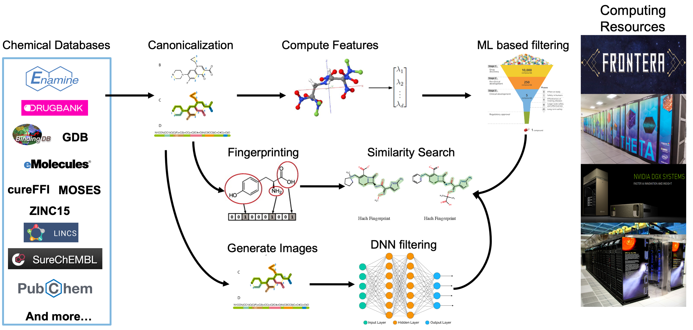

# The nCov-Group Data Repository
{: .fs-9 .no_toc }

## AI- and HPC-enabled Generated Leads for SARS-CoV-2 Drugs
{: .no_toc }

This repository provides access to data, models, and code produced by the **nCoV Group** in support of research aimed at generating leads for potential SARS-CoV-2 drugs. The data include representations and computed descriptors for around **3.8 billion** small molecules: some 80 TB of data in all, although many useful subsets are much smaller.

These data will be updated regularly as the collaboration produces new results. Shared data are located on the ALCF Petrel data store [at this location](https://app.globus.org/file-manager?origin_id=a386b552-6086-11ea-9688-0e56c063f437&origin_path=%2Frelease%2F), from where they can be retrieved via [Globus](https://www.globus.org). To access the data, users can register for a free Globus account ([here](https://www.globus.org)).


## Table of contents
{: .no_toc }

* TOC
{:toc}

Note:
{: .label .label-green }
A manuscript describing these data and the associated methodology and processing pipelines is under preparation. A link will be posted here when it is available.

## Data Processing Pipeline
The data processing pipeline is used to compute different types of features and representations of billions of small molecules.  The pipeline first converts the SMILES representation for each molecule to **a canonical SMILES form**. (De-duplication is in progress.) It then creates, for each molecule, three different types of features:
1) **molecular fingerprints** that encode the structure of molecules;
2) **molecular descriptors** (using [Mordred](https://github.com/mordred-descriptor/mordred)); and
3) **2D images** of the molecular structure.  These features are being used as input to various machine learning and deep learning models that predict important characteristics including docking scores, toxicity, and more.




---

## Dataset Catalog
We have obtained molecule definitions from the following source datasets.
For each, we provide a link to the original source, the number of molecules included from the dataset,
and the percentage of those molecules that are not found in any other listed dataset.

Key | Description and link | # Molecules | % Unique
:-: | --- | --: | --:
BDB | [The Binding Database](https://www.bindingdb.org/bind/index.jsp) | 1,813,538 | 20.44
CAS | [CAS COVID-19 Antiviral Candidate Compounds](https://www.cas.org/covid-19-antiviral-compounds-dataset) | 49,437 | 55.46
DBK | [Drugbank](https://www.drugbank.ca) | 9,678 | 76.07
DCL | [DrugCentral Online Drug Compendium](http://drugcentral.org) | 3,981 | 2.41
DUD | [DUDE database of useful decoys](http://dude.docking.org) | 99,782 | 99.74
E15 | [15.5M-molecule subset of ENA | 15,547,091 | 99.73
EDB | [DrugBank plus [Enamine Hit Locator Library 2018](https://enamine.net/hit-finding/diversity-libraries/hit-locator-library-300) | 310,782 | 61.20
EMO | [eMolecules](https://www.emolecules.com/info/products-data-downloads.html) | 25,946,988 | 93.93
ENA | [Enamine REAL Database](https://enamine.net/library-synthesis/real-compounds/real-database) | 1,211,723,723 | 85.90
FFI | [CureFFI FDA-approved drugs and CNS drugs](https://www.cureffi.org/2013/10/04/list-of-fda-approved-drugs-and-cns-drugs-with-smiles/) | 1,497 | 12.22
G13 | [GDB-13 small organic molecules up to 13 atoms of CNOSCl](http://gdb.unibe.ch/downloads/) | 977,468,301 | 99.51
G17 | [GDB-17-Set subset of up to 17 atom extension of GDB-13](http://gdb.unibe.ch/downloads/) | 50,000,000 | 99.98
HOP | [Harvard Organic Photovoltaic Dataset](https://www.nature.com/articles/sdata201686) | 350 | 83.71
L1K | [L1000](http://www.lincsproject.org) | 10,141 | 0.00
MOS | [Molecular Sets (MOSES)](https://github.com/molecularsets/moses) | 1,936,962 | 81.33
PCH | [PubChem](https://www.ncbi.nlm.nih.gov/guide/data-software/) | 97,545,266 | 48.48
QM9 | [QM9 subset of GDB-17](http://quantum-machine.org/datasets/) | 133,885 | 84.04
REP | [Repurposing related drug and tool compound annotations](https://clue.io/data/REP#REP) | 10,141 | 0.00
SAV | [Synthetically Accessible Virtual Inventory (SAVI)](https://cactus.nci.nih.gov/download/savi_download/) | 265,047,097 | 99.79
SUR | [SureChEMBL dataset of molecules from patents](https://surechembl.org/) | 17,915,384 | 9.84
ZIN | [ZINC15](http://zinc15.docking.org) | 1,225,804,829 | 85.10
**Total** | | **3,891,378,853** | 

3891378853

Notes:
{: .label .label-blue }
* The key for each dataset may be used in filenames in place of the full name in downloads elsewhere. 
* The numbers above may be less than what can be found at the source, due to conversion failures and/or version differences.
* These numbers do not account for de-duplication, within or between datasets.

## Dataset Downloads
Follow the links below to access canonical SMILES, molecular fingerprints, descriptors, and images (png format) for each dataset.  The links in the final row provide access to all SMILES, fingerprints, descriptors, and images, respectively.

Key | Canonical SMILES | Fingerprints | Descriptors | Images
:-: | :-: | :-: | :-:  | :-:
BDB | [1 file; 132 MB](https://app.globus.org/file-manager?origin_id=a386b552-6086-11ea-9688-0e56c063f437&origin_path=/release/v1.0/canonical_smiles/BDB/) | [2 files; 302 MB](https://app.globus.org/file-manager?origin_id=a386b552-6086-11ea-9688-0e56c063f437&origin_path=/release/v1.0/fingerprints/BDB/) | TBD | TBD | 
CAS | [1 file; 4 MB](https://app.globus.org/file-manager?origin_id=a386b552-6086-11ea-9688-0e56c063f437&origin_path=/release/v1.0/canonical_smiles/CAS/) | [1 file; 9 MB](https://app.globus.org/file-manager?origin_id=a386b552-6086-11ea-9688-0e56c063f437&origin_path=/release/v1.0/fingerprints/CAS/) | [5 files; 350 MB](https://app.globus.org/file-manager?origin_id=a386b552-6086-11ea-9688-0e56c063f437&origin_path=/release/v1.0/descriptors/CAS/) | [5 files; 2 GB](https://app.globus.org/file-manager?origin_id=a386b552-6086-11ea-9688-0e56c063f437&origin_path=/release/v1.0/images/CAS/) | 
DBK | [1 file; 650 KB](https://app.globus.org/file-manager?origin_id=a386b552-6086-11ea-9688-0e56c063f437&origin_path=/release/v1.0/canonical_smiles/DBK/) | [2 files; 2 MB](https://app.globus.org/file-manager?origin_id=a386b552-6086-11ea-9688-0e56c063f437&origin_path=/release/v1.0/fingerprints/DBK/) | [1 file; 71 MB](https://app.globus.org/file-manager?origin_id=a386b552-6086-11ea-9688-0e56c063f437&origin_path=/release/v1.0/descriptors/DBK/) | [1 file; 476 MB](https://app.globus.org/file-manager?origin_id=a386b552-6086-11ea-9688-0e56c063f437&origin_path=/release/v1.0/images/DBK/) | 
DCL | [1 file; 260 KB](https://app.globus.org/file-manager?origin_id=a386b552-6086-11ea-9688-0e56c063f437&origin_path=/release/v1.0/canonical_smiles/DCL/) | [1 file; 576 KB](https://app.globus.org/file-manager?origin_id=a386b552-6086-11ea-9688-0e56c063f437&origin_path=/release/v1.0/fingerprints/DCL/) | [1 file; 29 MB](https://app.globus.org/file-manager?origin_id=a386b552-6086-11ea-9688-0e56c063f437&origin_path=/release/v1.0/descriptors/DCL/) | [1 file; 196 MB](https://app.globus.org/file-manager?origin_id=a386b552-6086-11ea-9688-0e56c063f437&origin_path=/release/v1.0/images/DCL/) | 
DUD | [1 file; 7 MB](https://app.globus.org/file-manager?origin_id=a386b552-6086-11ea-9688-0e56c063f437&origin_path=/release/v1.0/canonical_smiles/DUD/) | [2 files; 32 MB](https://app.globus.org/file-manager?origin_id=a386b552-6086-11ea-9688-0e56c063f437&origin_path=/release/v1.0/fingerprints/DUD/) | [10 files; 745 MB](https://app.globus.org/file-manager?origin_id=a386b552-6086-11ea-9688-0e56c063f437&origin_path=/release/v1.0/descriptors/DUD/) | [10 files; 4 GB](https://app.globus.org/file-manager?origin_id=a386b552-6086-11ea-9688-0e56c063f437&origin_path=/release/v1.0/images/DUD/) | 
E15 | [1 file; 1 GB](https://app.globus.org/file-manager?origin_id=a386b552-6086-11ea-9688-0e56c063f437&origin_path=/release/v1.0/canonical_smiles/E15/) | [16 files; 2 GB](https://app.globus.org/file-manager?origin_id=a386b552-6086-11ea-9688-0e56c063f437&origin_path=/release/v1.0/fingerprints/E15/) | [1,555 files; 116 GB](https://app.globus.org/file-manager?origin_id=a386b552-6086-11ea-9688-0e56c063f437&origin_path=/release/v1.0/descriptors/E15/) | [1,555 files; 765 GB](https://app.globus.org/file-manager?origin_id=a386b552-6086-11ea-9688-0e56c063f437&origin_path=/release/v1.0/images/E15/) | 
EDB | [1 file; 18 MB](https://app.globus.org/file-manager?origin_id=a386b552-6086-11ea-9688-0e56c063f437&origin_path=/release/v1.0/canonical_smiles/EDB/) | [1 file; 44 MB](https://app.globus.org/file-manager?origin_id=a386b552-6086-11ea-9688-0e56c063f437&origin_path=/release/v1.0/fingerprints/EDB/) | [28 files; 2 GB](https://app.globus.org/file-manager?origin_id=a386b552-6086-11ea-9688-0e56c063f437&origin_path=/release/v1.0/descriptors/EDB/) | [32 files; 15 GB](https://app.globus.org/file-manager?origin_id=a386b552-6086-11ea-9688-0e56c063f437&origin_path=/release/v1.0/images/EDB/) | 
EMO | [1 file; 1 GB](https://app.globus.org/file-manager?origin_id=a386b552-6086-11ea-9688-0e56c063f437&origin_path=/release/v1.0/canonical_smiles/EMO/) | [26 files; 3 GB](https://app.globus.org/file-manager?origin_id=a386b552-6086-11ea-9688-0e56c063f437&origin_path=/release/v1.0/fingerprints/EMO/) | [2,232 files; 165 GB](https://app.globus.org/file-manager?origin_id=a386b552-6086-11ea-9688-0e56c063f437&origin_path=/release/v1.0/descriptors/EMO/) | [2,595 files; 1 TB](https://app.globus.org/file-manager?origin_id=a386b552-6086-11ea-9688-0e56c063f437&origin_path=/release/v1.0/images/EMO/) | 
ENA | [1 file; 85 GB](https://app.globus.org/file-manager?origin_id=a386b552-6086-11ea-9688-0e56c063f437&origin_path=/release/v1.0/canonical_smiles/ENA/) | [1,212 files; 191 GB](https://app.globus.org/file-manager?origin_id=a386b552-6086-11ea-9688-0e56c063f437&origin_path=/release/v1.0/fingerprints/ENA/) | [120,692 files; 8 TB](https://app.globus.org/file-manager?origin_id=a386b552-6086-11ea-9688-0e56c063f437&origin_path=/release/v1.0/descriptors/ENA/) | TBD | 
FFI | [1 file; 117 KB](https://app.globus.org/file-manager?origin_id=a386b552-6086-11ea-9688-0e56c063f437&origin_path=/release/v1.0/canonical_smiles/FFI/) | [1 file; 239 KB](https://app.globus.org/file-manager?origin_id=a386b552-6086-11ea-9688-0e56c063f437&origin_path=/release/v1.0/fingerprints/FFI/) | [1 file; 11 MB](https://app.globus.org/file-manager?origin_id=a386b552-6086-11ea-9688-0e56c063f437&origin_path=/release/v1.0/descriptors/FFI/) | [1 file; 73 MB](https://app.globus.org/file-manager?origin_id=a386b552-6086-11ea-9688-0e56c063f437&origin_path=/release/v1.0/images/FFI/) | 
G13 | [1 file; 36 GB](https://app.globus.org/file-manager?origin_id=a386b552-6086-11ea-9688-0e56c063f437&origin_path=/release/v1.0/canonical_smiles/G13/) | [978 files; 101 GB](https://app.globus.org/file-manager?origin_id=a386b552-6086-11ea-9688-0e56c063f437&origin_path=/release/v1.0/fingerprints/G13/) | [97,739 files; 7 TB](https://app.globus.org/file-manager?origin_id=a386b552-6086-11ea-9688-0e56c063f437&origin_path=/release/v1.0/descriptors/G13/) | TBD | 
G17 | [1 file; 2 GB](https://app.globus.org/file-manager?origin_id=a386b552-6086-11ea-9688-0e56c063f437&origin_path=/release/v1.0/canonical_smiles/G17/) | [51 files; 5 GB](https://app.globus.org/file-manager?origin_id=a386b552-6086-11ea-9688-0e56c063f437&origin_path=/release/v1.0/fingerprints/G17/) | [5,000 files; 371 GB](https://app.globus.org/file-manager?origin_id=a386b552-6086-11ea-9688-0e56c063f437&origin_path=/release/v1.0/descriptors/G17/) | [5,000 files; 2 TB](https://app.globus.org/file-manager?origin_id=a386b552-6086-11ea-9688-0e56c063f437&origin_path=/release/v1.0/images/G17/) | 
HOP | [1 file; 37 KB](https://app.globus.org/file-manager?origin_id=a386b552-6086-11ea-9688-0e56c063f437&origin_path=/release/v1.0/canonical_smiles/HOP/) | [1 file; 68 KB](https://app.globus.org/file-manager?origin_id=a386b552-6086-11ea-9688-0e56c063f437&origin_path=/release/v1.0/fingerprints/HOP/) | [1 file; 2 MB](https://app.globus.org/file-manager?origin_id=a386b552-6086-11ea-9688-0e56c063f437&origin_path=/release/v1.0/descriptors/HOP/) | [1 file; 17 MB](https://app.globus.org/file-manager?origin_id=a386b552-6086-11ea-9688-0e56c063f437&origin_path=/release/v1.0/images/HOP/) | 
L1K | [1 file; 643 KB](https://app.globus.org/file-manager?origin_id=a386b552-6086-11ea-9688-0e56c063f437&origin_path=/release/v1.0/canonical_smiles/L1K/) | [1 file; 1 MB](https://app.globus.org/file-manager?origin_id=a386b552-6086-11ea-9688-0e56c063f437&origin_path=/release/v1.0/fingerprints/L1K/) | [2 files; 46 MB](https://app.globus.org/file-manager?origin_id=a386b552-6086-11ea-9688-0e56c063f437&origin_path=/release/v1.0/descriptors/L1K/) | [2 files; 499 MB](https://app.globus.org/file-manager?origin_id=a386b552-6086-11ea-9688-0e56c063f437&origin_path=/release/v1.0/images/L1K/) | 
MOS | [1 file; 93 MB](https://app.globus.org/file-manager?origin_id=a386b552-6086-11ea-9688-0e56c063f437&origin_path=/release/v1.0/canonical_smiles/MOS/) | [2 files; 250 MB](https://app.globus.org/file-manager?origin_id=a386b552-6086-11ea-9688-0e56c063f437&origin_path=/release/v1.0/fingerprints/MOS/) | [194 files; 14 GB](https://app.globus.org/file-manager?origin_id=a386b552-6086-11ea-9688-0e56c063f437&origin_path=/release/v1.0/descriptors/MOS/) | [123 files; 60 GB](https://app.globus.org/file-manager?origin_id=a386b552-6086-11ea-9688-0e56c063f437&origin_path=/release/v1.0/images/MOS/) | 
PCH | [1 file; 6 GB](https://app.globus.org/file-manager?origin_id=a386b552-6086-11ea-9688-0e56c063f437&origin_path=/release/v1.0/canonical_smiles/PCH/) | [98 files; 14 GB](https://app.globus.org/file-manager?origin_id=a386b552-6086-11ea-9688-0e56c063f437&origin_path=/release/v1.0/fingerprints/PCH/) | [9,755 files; 725 GB](https://app.globus.org/file-manager?origin_id=a386b552-6086-11ea-9688-0e56c063f437&origin_path=/release/v1.0/descriptors/PCH/) | [9,754 files; 4 TB](https://app.globus.org/file-manager?origin_id=a386b552-6086-11ea-9688-0e56c063f437&origin_path=/release/v1.0/images/PCH/) | 
QM9 | [1 file; 3 MB](https://app.globus.org/file-manager?origin_id=a386b552-6086-11ea-9688-0e56c063f437&origin_path=/release/v1.0/canonical_smiles/QM9/) | [1 file; 10 MB](https://app.globus.org/file-manager?origin_id=a386b552-6086-11ea-9688-0e56c063f437&origin_path=/release/v1.0/fingerprints/QM9/) | [14 files; 993 MB](https://app.globus.org/file-manager?origin_id=a386b552-6086-11ea-9688-0e56c063f437&origin_path=/release/v1.0/descriptors/QM9/) | [14 files; 6 GB](https://app.globus.org/file-manager?origin_id=a386b552-6086-11ea-9688-0e56c063f437&origin_path=/release/v1.0/images/QM9/) | 
REP | [1 file; 623 KB](https://app.globus.org/file-manager?origin_id=a386b552-6086-11ea-9688-0e56c063f437&origin_path=/release/v1.0/canonical_smiles/REP/) | [1 file; 1 MB](https://app.globus.org/file-manager?origin_id=a386b552-6086-11ea-9688-0e56c063f437&origin_path=/release/v1.0/fingerprints/REP/) | [1 file; 46 MB](https://app.globus.org/file-manager?origin_id=a386b552-6086-11ea-9688-0e56c063f437&origin_path=/release/v1.0/descriptors/REP/) | [1 file; 307 MB](https://app.globus.org/file-manager?origin_id=a386b552-6086-11ea-9688-0e56c063f437&origin_path=/release/v1.0/images/REP/) | 
SAV | [1 file; 28 GB](https://app.globus.org/file-manager?origin_id=a386b552-6086-11ea-9688-0e56c063f437&origin_path=/release/v1.0/canonical_smiles/SAV/) | [266 files; 55 GB](https://app.globus.org/file-manager?origin_id=a386b552-6086-11ea-9688-0e56c063f437&origin_path=/release/v1.0/fingerprints/SAV/) | [28,323 files; 2 TB](https://app.globus.org/file-manager?origin_id=a386b552-6086-11ea-9688-0e56c063f437&origin_path=/release/v1.0/descriptors/SAV/) | [26,282 files; 12 TB](https://app.globus.org/file-manager?origin_id=a386b552-6086-11ea-9688-0e56c063f437&origin_path=/release/v1.0/images/SAV/) | 
SUR | [1 file; 1 GB](https://app.globus.org/file-manager?origin_id=a386b552-6086-11ea-9688-0e56c063f437&origin_path=/release/v1.0/canonical_smiles/SUR/) | [18 files; 2 GB](https://app.globus.org/file-manager?origin_id=a386b552-6086-11ea-9688-0e56c063f437&origin_path=/release/v1.0/fingerprints/SUR/) | [1,792 files; 132 GB](https://app.globus.org/file-manager?origin_id=a386b552-6086-11ea-9688-0e56c063f437&origin_path=/release/v1.0/descriptors/SUR/) | TBD | 
ZIN | [1 file; 85 GB](https://app.globus.org/file-manager?origin_id=a386b552-6086-11ea-9688-0e56c063f437&origin_path=/release/v1.0/canonical_smiles/ZIN/) | [1,226 files; 193 GB](https://app.globus.org/file-manager?origin_id=a386b552-6086-11ea-9688-0e56c063f437&origin_path=/release/v1.0/fingerprints/ZIN/) | [147,132 files; 10 TB](https://app.globus.org/file-manager?origin_id=a386b552-6086-11ea-9688-0e56c063f437&origin_path=/release/v1.0/descriptors/ZIN/) | TBD | 
**Total** | [**21 files; 248 GB**](https://app.globus.org/file-manager?origin_id=a386b552-6086-11ea-9688-0e56c063f437&origin_path=/release/v1.0/canonical_smiles) | [**3,907 files; 571 GB**](https://app.globus.org/file-manager?origin_id=a386b552-6086-11ea-9688-0e56c063f437&origin_path=/release/v1.0/fingerprints) | [**414 K files; 30 TB**](https://app.globus.org/file-manager?origin_id=a386b552-6086-11ea-9688-0e56c063f437&origin_path=/release/v1.0/descriptors) | [**412 K files; 49 TB**](https://app.globus.org/file-manager?origin_id=a386b552-6086-11ea-9688-0e56c063f437&origin_path=/release/v1.0/images) | 

## Methodology and Data Formats

### Converting to SMILES Canonical Form
{: .no_toc }

We use [Open Babel](https://openbabel.org/wiki/Main_Page) to convert the simplified molecular-input line-entry system ([SMILES](https://en.wikipedia.org/wiki/Simplified_molecular-input_line-entry_system)) specifications of chemical species obtained from various sources into a consistent canonical smiles representation:
```
obabel {filename} -O can_{filename} -ocan -e
```

We organize the resulting molecule specifications in one directory per source dataset, each containing one CSV file with format <SOURCE-KEY, IDENTIFIER, SMILES>, where:

* SOURCE-KEY, as defined above, identifies the source dataset
* IDENTIFIER is an identifier, either obtained for the source dataset or (if none such is available) defined by us. Identifiers are unique within a dataset, but may not be unique across datasets. Thus it is recommended to use the combination SOURCE-KEY+IDENTIFER to identify molecules.
* SMILES is a canonical smile as produced by Open Babel

### Computing Fingerprints
{: .no_toc }

We use [RDKit](https://www.rdkit.org) to compute a 2034-bit fingerprint for each molecule.

We organize these fingerprints in CSV files with format <SOURCE-KEY, IDENTIFIER, SMILES, FINGERPRINT>, where SOURCE-KEY, IDENTIFIER, and SMILES are as above, and DESCRIPTOR is a Base64-encoded representation of the fingerprint.


### Calculating Descriptors
{: .no_toc }
We generate molecular descriptors using [Mordred](https://github.com/mordred-descriptor/mordred). The collected descriptors (~1800 for each molecule) include both 2D and 3D descriptors.

We organize these descriptors in one directory per source dataset, each containing one or more PKL files, each organized internally as a Python dictionary with entries in the form:
```
{ SMILES:  (
    [IDENTIFIER], 
    NumPy Array[descriptor1, descriptor2, .., descriptorN]
    ),  
..
}
```
where SMILES and IDENTIFIER are as described above, and the floating point array is the descriptor.

### Creating 2D Molecule Images
{: .no_toc }
We use [RDKit](https://www.rdkit.org) to create a 128x128 images of each molecule. 

We organize these data as png formatted images in pickle files that can be read in Python following:
```python
import pickle
p = pickle.load(open(‘/data/pubchem/images/pubchem-0-100.pkl’, 'rb'))

print(p[:5])

[('PC', '', 'CC(=O)OC(CC(=O)[O-])C[N+](C)(C)C', <PIL.PngImagePlugin.PngImageFile image mode=RGB size=128x128 at 0x7F7E1D5259D0>), 
('PC', '', 'CC(=O)OC(CC(=O)O)C[N+](C)(C)C', <PIL.PngImagePlugin.PngImageFile image mode=RGB size=128x128 at 0x7F7E1D4B8810>), 
('PC', '', 'C1=CC(C(C(=C1)C(=O)O)O)O', <PIL.PngImagePlugin.PngImageFile image mode=RGB size=128x128 at 0x7F7E1D058E90>), 
('PC', '', 'CC(CN)O', <PIL.PngImagePlugin.PngImageFile image mode=RGB size=128x128 at 0x7F7E1D058F90>), 
('PC', '', 'C(C(=O)COP(=O)(O)O)N', <PIL.PngImagePlugin.PngImageFile image mode=RGB size=128x128 at 0x7F7E1D05F090>)]

```


### Code
{: .no_toc }

Code to help users understand the methodology and use the data are included in the 
[Globus Labs Covid Analyses](href="https://github.com/globus-labs/covid-analyses) GitHub repository.

##  Data Extraction from Literature
The data extraction team is working to extract a set of known antiviral molecules that have been previously tested against coronaviruses. 
This set of molecules will inform future efforts to screen candidates using simulated docking and more. There are two efforts current underway, a manual extraction effort, and an effort to build a named-entity recognition model that aims to automatically from a much larger literature corpus. 

### Manual Extraction of Antivirals from Literature
{: .no_toc }
Coming Soon
{: .label .label-yellow }

### Named-Entity Recognition Models for Identification of Antivirals
{: .no_toc }
Coming Soon
{: .label .label-yellow }


<!-- ## Contributing
Information on how to contribute to this project will be added shortly. -->

## Acknowledgements

Data storage and computational support for this research project has been generously supported by the following resources. The data generated have been prepared as part of the nCov-Group Collaboration, a group of over 200 researchers working to use computational techniques to address various challenges associated with COVID-19.

### Petrel Data Service at the Argonne Leadership Computing Facility (ALCF)
{: .no_toc }
This research used resources of the Argonne Leadership Computing Facility, a DOE Office of Science User Facility supported under Contract DE-AC02-06CH11357.

[Petrel](https://press3.mcs.anl.gov/petrel/){: .btn .btn-outline}

### Theta at the Argonne Leadership Computing Facility (ALCF)
{: .no_toc }
This research used resources of the Argonne Leadership Computing Facility, a DOE Office of Science User Facility supported under Contract DE-AC02-06CH11357.

[ALCF](https://www.alcf.anl.gov){: .btn .btn-outline}


### Frontera at the Texas Advanced Computing Center (TACC)
{: .no_toc }
[TACC](https://www.tacc.utexas.edu){: .btn .btn-outline}


### Comet at the San Diego Supercomputing Center (SDSC)
{: .no_toc }
[SDSC](https://www.sdsc.edu){: .btn .btn-outline}

### Data and Computing Infrastructure
{: .no_toc }
Many aspects of the data and computing infrastructure have been leveraged from other projects including but not limited to:

Data processing and computation:
 * ExaLearn and the <a href="https://www.exascaleproject.org">Exascale Computing Project</a>
 * <a href="https://parsl-project.org">Parsl</a>: parallel scripting libarary (NSF 1550588)
 * <a href="https://www.funcx.org">funcX</a>: distributed function as a service platform (NSF 2004894)

Data Tools, Services, and Expertise:
 * <a href="https://www.globus.org">Globus</a>: data services for science (authentication, transfer, users, and groups) 
 * <a href="https://chimad.northwestern.edu">CHiMaD</a>: <a href="https://materialsdatafacility.org">Materials Data Facility </a> and <a href="http://pppdb.uchicago.edu">Polymer Property Predictor Database</a> (NIST 70NANB19H005 and NIST 70NANB14H012)

